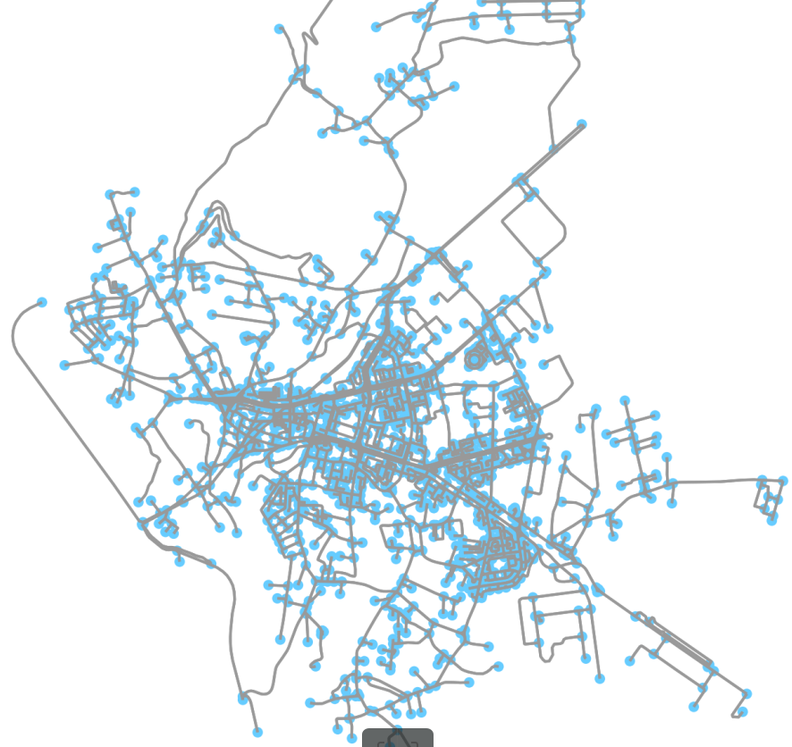
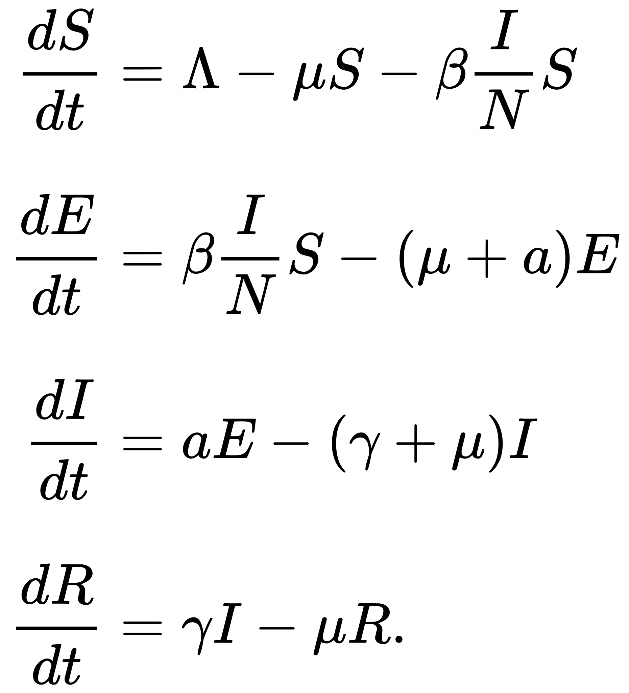

# Simulating spreading of Coronavirus in a town using Python

This post attepmts to model the spreading of novel SARS-CoV-2 into a small Romanian town ([Slatina, Olt County](https://en.wikipedia.org/wiki/Slatina,_Romania)) by applying different [comportamental model in epidemiology.](https://en.wikipedia.org/wiki/Compartmental_models_in_epidemiology)

Due to [small world network](https://en.wikipedia.org/wiki/Small-world_network) effect, where a signfiant part of the network elements are neighbors of one another, spreading of a disease can happen faster in small to medium communites. This post is entirely based on [network-based diffusion analysis](https://en.wikipedia.org/wiki/Network-based_diffusion_analysis) which is a quantifier for transmision / diffusion of a behaviour into a social network.  

The analysis was made using Python and open source libaries (detailed below). **The post is aimed to show benefits of social distancing (from a statistical point of view)**

### !!Disclaimer!! This is not a medical article. Analysis is made entirely using statistical and probabilistic modelling and may not reflect the truly evolution of the disease. 

## Fetching the network

In order to obatain the network topology I used [OpenStreetMap](https://www.openstreetmap.org/#map=7/45.996/24.981) together with opensource library [osmnx](https://github.com/gboeing/osmnx). 

In this topology each edge represent a road and each node is represented by either an intersection or a cul-de-sac. Information difussion is modelled by assigning different weights to each node by it's importance (with higher weights asigned to more central nodes - e.g. trasnportation hubs, city center, markets). 

After this operation, the output will be a [networkx object](https://networkx.github.io/documentation/stable/tutorial.html#creating-a-graph) which can be further converted into Shapefile or GraphML files to implement other GIS analysis.

## Modelling the transmision

For network diffusion analysis [NDlib opensource library](https://ndlib.readthedocs.io/en/latest/overview.html) will be used. 

For modelling the disease diffusion I will use SEIR model. As a short introduction, SEIR model is a compartmental model which show how a disease spreads through a population. It’s an acronym for Susceptible, Exposed, Infected, Recovered. This model is extending the SIR model by adding "Exposed" state as being a period during which the individual has been infected but is not yet infectious themselves

SEIR model was succesfully aplied in modelling transmision of SARS virus during 2003 epidemic. 

### SEIR model:

Luckily, paramteres for SEIR model were already estimated in a [recent study by Hellewell et al. 2020](https://www.thelancet.com/journals/langlo/article/PIIS2214-109X(20)30074-7/fulltext):
  * α = 0.2 (Median incubation period is 5 days)
  * R0 = 3.5
  * γ = 0.5

## Running simulation

Running the model with a **high contact rate** will result in a very short period of time in a massive infection. **At peack time (around day 20-25) more than 70% of the population will be infected**. The prevalence plot captures the variation (delta) of nodes for each status in consecutive iterations, also showing a high standard deviation from day-to-day evolution

  
   

### Implementing social distancing

From a network topology perspective, social distancing is created by altering some of the meaningful metrics:
 * [Katz centrality](https://en.wikipedia.org/wiki/Katz_centrality)
 * [Closeness centrality](https://en.wikipedia.org/wiki/Closeness_centrality)
 * removing several attractor nodes

In SEIR model, social distancing can be enforced by varying contact rate β(t).

  
   

Above result shows that **reducing urban mobility by 66% percent, the peek of the epidemics will happen about 10 days earlier (days 10-15) and only 40% of the population will be infected at peak time.** Translated in real world action, reducing urban mobility can be done by closing cultural and social gathering hubs as well as limiting movement of population for non-essential activities.

## Future work

Because SARS-CoV-2 is a virus which seems to stronger affect eldery population, in the future the model will be updated to better emphasise this aspect by implementing [aged structured models](https://en.wikipedia.org/wiki/Compartmental_models_in_epidemiology#The_influence_of_age:_age-structured_models).

Also, beacuse spreading of the virus happen in even smaller comunities (families, offices), the model will be further adapted by [thresholding techniques](https://ndlib.readthedocs.io/en/latest/custom/compartments/NodeThreshold.html) meaning that in order for a node to become "Infected" there should exist at least a percentage beta (β) of Infected neighbors.

# TL;DR

### Simulation result for a small network representing Slatina, Romania, shows that social distancing will dramatically diminish the effects of Coronavirus over the population.

### Thank you for reading till the end !
